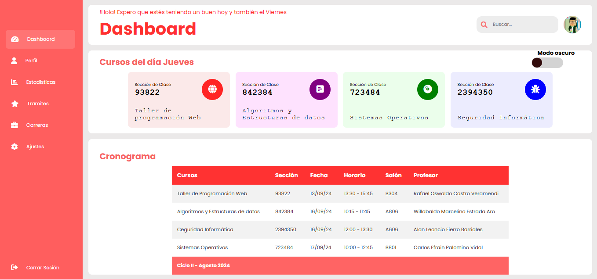
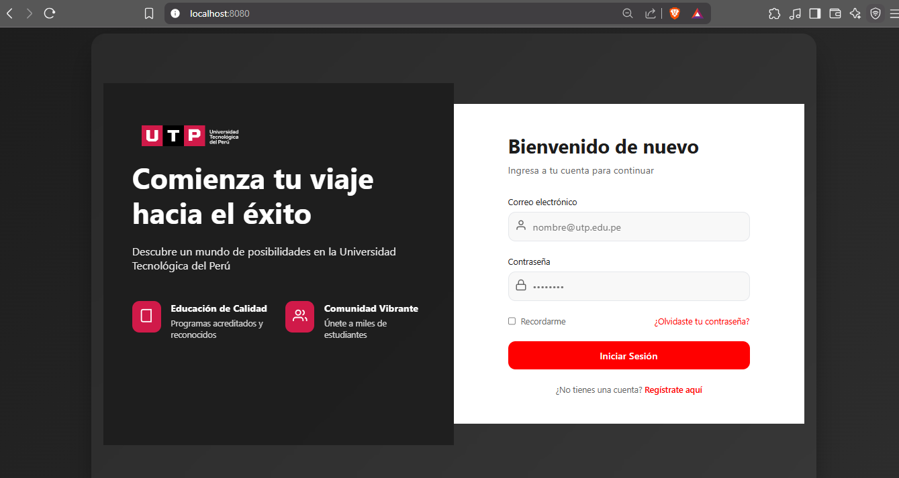
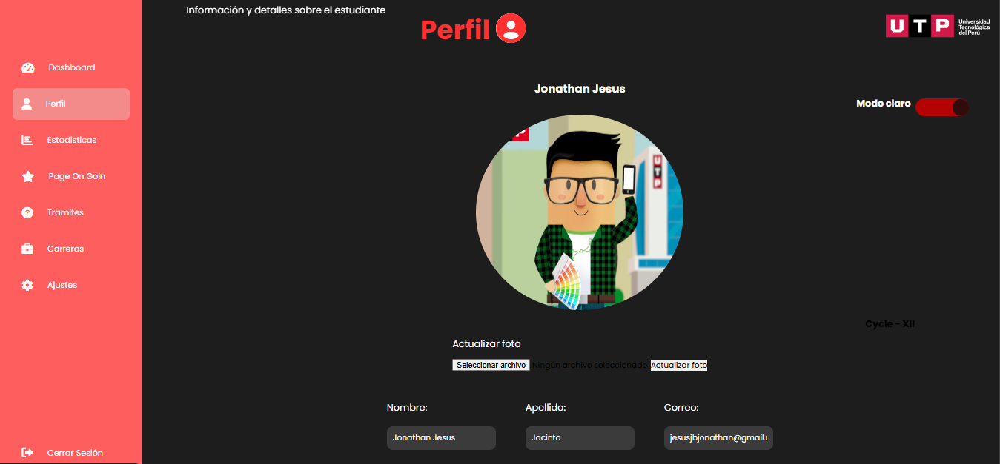

# 🎓 Taller Web UTP 🚀  

**Taller Web UTP** es un proyecto desarrollado en **HTML, CSS y JavaScript**, con **Node.js** como tecnología principal para simular el sitio web de la **Universidad Tecnológica del Perú (UTP)**.  
Este proyecto tiene como propósito demostrar mis habilidades en el desarrollo web y servir como una presentación en mi universidad.  

📂 **Estructura del Proyecto**  
- `assets/` - Recursos estáticos (imágenes, CSS, JS).
- `pages/` - Páginas adicionales del sitio.
- `uploads/` - Archivos subidos (como fotos).
- `app.js` - Servidor principal con Node.js.
- `index.html` - Página principal del frontend.
---

## 📸 Vista Previa
Aquí tienes una idea de cómo luce el proyecto:

### Página Principal


### Sección de Inicio de Sesión


### Perfil de Usuario


---

## 📌 Requisitos previos  

Antes de ejecutar el proyecto, asegúrate de tener instalados los siguientes paquetes y herramientas en tu sistema:  

🖥 **Instalar Node.js y npm** (si aún no los tienes):  

```bash
sudo apt update && sudo apt install nodejs npm -y
```

## 📥 Clonar el repositorio y acceder a la carpeta del proyecto:

```bash
git clone https://github.com/TuUsuario/Proyecto-Web-UTP.git
cd Taller-Web-UTP
```

## 📦 Instalar dependencias del proyecto:

```bash
npm install
```

## 🚀 Instrucciones de Uso
Para iniciar el servidor y ejecutar la aplicación, usa el siguiente comando:

```bash
npm start
```

**Esto iniciará el servidor y podrás acceder a la aplicación en tu navegador en la siguiente dirección:**

## 🌍 Abrir en el navegador:
```
http://localhost:8080
```
